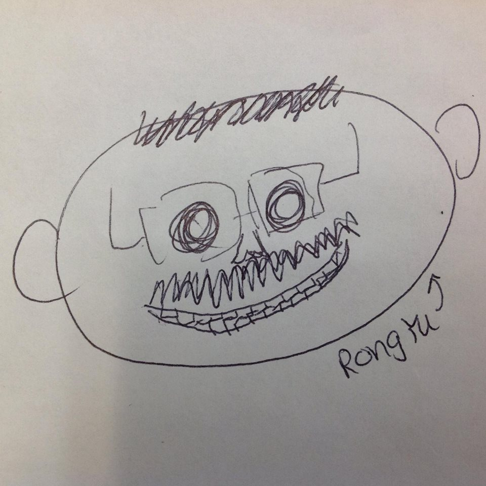

# MusiFind

### Objective: Music Search Engine

###APIs Used

- Spotify API
- Echonest API

###Contributors

|                                       |   **Member**   |                   **GitHub**                 |            **Role**            |
|---------------------------------------|:--------------:|:--------------------------------------------:|:------------------------------:|
|  | Albert Mokrejs   |[`@AlbertMokrejs`](https://github.com/AlbertMokrejs)        | Backend - API Handler  |
|  | Samuel Zhang |[`@CodeSammich`](https://github.com/CodeSammich)    | Backend - Thread Handler, Branch Manager  |
|  | Ari Hatzimemos    |[`@ahatzi`](https://github.com/ahatzi)| Frontend - Overseer/Editor |
|   | Rong Yu  |[`@RongYu98`](https://github.com/RongYu98)        | Frontend - Designer  |

###Algorithm

The DopeAPI project makes use of a search-box to make an API-call to EchoNest to find an artist of a similar name, removing typos and similar errors. Then, it finds a list of image links for the artist selected, and runs through all of them using multiple threads and server calls to make sure they point to valid images. If they do, it adds them to a list of valid images. Finally, the Spotify's API is used to find the top tracks for the artist.
